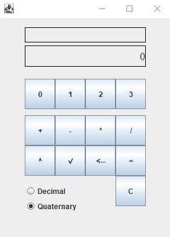
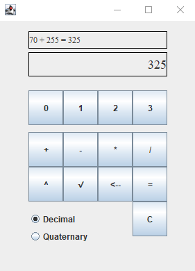
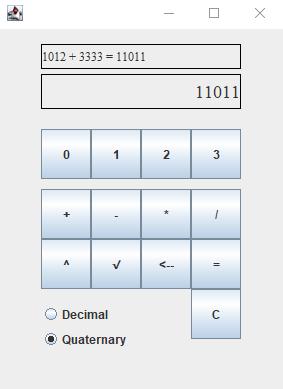

<h1>Quaternary Calculator Group 4</h1>

<h2>How to Use</h2>

    After downloading the project and running the UI class, 
    click the number buttons on the calculator to form a quaternary number. 
    Then press one of the buttons for the corresponding operation: 

<ul>
    <li>' + ' for addition with the next digit entered</li>
    <li>' - ' for subtraction with the next digit entered</li>
    <li>' * ' for multiplication  with the next digit entered</li>
    <li>' / ' for division with the next digit entered</li>
    <li>' ^ ' for squaring the previous digit entered</li>
    <li>' √ ' for finding the square root of previous digit</li>
</ul>

    Click on another number if needed for the current operation. To display your answer, simply press the '='.
    You can also press 'C' to reset the current operation, or press ' <-- ' to clear the last digit.
    Use the radio buttons at the bottom to toggle the operation above the input from 
    quaternary to decimal, or vice-versa.
       
    <strong>Toggling Bases:</strong> As you are entering your input, 
    it will <strong>always</strong> show up as quaternary. However, the build operation
    above the input field will always display the selected base system. Also note that the
    input field will display the <storng>final answer</storng> in the selected base system.

<h2>General Idea of Process</h2>
<ol type = 1>
    <li>The user will interact with the UI class by entering numbers and operations (base4)</li>
    <li>The UI class will send that input to the Converter class</li>
    <li>Inside the Converter class, the base 4 input will be converted to base 10</li>
    <li>The edited input will be sent from the Converter class to the Calculator class</li>
    <li>The Calculator class will calculate the operation in base 10</li>
    <li>The answer will be sent from the Calculator class to the Converter class</li>
    <li>The answer will be converted from base 10 into base 4</li>
    <li>The answer will be sent from the Converter class to the UI class</li>
    <li>The UI class will be shown to the user</li>
</ol>

<h2>Teamwork</h2>
<h3>Members</h3>
<ul>
    <li>Colin Ferguson</li>
    <li>Dotty Horsman</li>
    <li>Eric Vester</li>
    <li>Ethan Holland</li>
    <li>Hunter Durbin</li>
    <li>Jake Chappell</li>  
</ul>

<h3>Meetings</h3>
<ul>
    <li>9/10/21 5:00pm to 6:10pm - Everyone attended: 
        Talked about setting up the repository. 
        Planned out task distribution. 
        Created small task list of the general ideas of the project. 
        Planned out a few classes that might be needed for the project such as convertor and calc class. 
        Went over functional requirements and talked about problems.
        Had the team split up into two main groups: 2 people on UI, 4 people on logic. (not set in stone. Just something to keep us focused)</li>
</ul>

<h2>Assigned Tasks</h2>

BaseConvertor Class 
- [X] converts base 4 to base 10 (Hunter)
- [X] related test are made and pass (Hunter)
- [X] converts base 10 to 4 (Eric)
- [X] related test are made and pass (Jake)

Calculator Class
- [X] Addition (Jake)
- [X] Related test are made and pass (Jake)
- [X] Subtraction (Jake)
- [X] Related test are made and pass (Jake)
- [X] Multiplication (Jake)
- [X] Related test are made and pass (Jake)
- [X] Division (Jake)
- [X] Related test are made and pass (Jake)
- [X] Square root (Jake)
- [X] Related test are made and pass (Jake)
- [X] Squared (Jake)
- [X] Related test are made and pass (Jake)

UI class

Text display

- [X] When a user presses a button, related digit is shown (Ethan)

‘Toggle’ button & indicator on display 
- [X] Pressing this button, converts digit currently shown to the other base (Hunter)
- [X] It also changes the indicator on the display (4 → 10 or 10 → 4) (Hunter)

- [X] 0 button with connection to related logic (Colin/Ethan)
- [X] 1 button with connection to related logic (Colin/Ethan)
- [X] 2 button with connection to related logic (Colin/Ethan)
- [X] 3 button with connection to related logic (Colin/Ethan)
- [X] ‘=’ button with connection to related logic (Colin/Ethan)
- [X] ‘+’ button with connection to related logic (Colin/Ethan)
- [X] ‘-’ button with connection to related logic (Colin/Ethan)
- [X] ‘/’ button with connection to related logic (Colin/Ethan)
- [X] ‘*’ button with connection to related logic (Colin/Ethan)
- [X] ‘c’ button  with connection to related logic (Jake)
- [X] Squaring button with connection to related logic (Colin/Ethan)
- [X] Square rooting button with connection to related logic (Colin/Ethan)

Controller Class
- [X] sends info to and from each class (Hunter)
- [X] All tests pass

README.md contains ...
- [X] An explanation of the project (Dotty)
- [X] Dependencies (Dotty)
- [X] Tasks and division of labor are labelled with corresponding team member name (Dotty)
- [X] List of meetings that includes who attended, medium of meeting and points of discussion (Hunter)

<h2>Dependencies</h2>
<ul>
    <li>testCompile('org.junit.jupiter:junit-jupiter-api:5.3.1')</li>
    <li>testCompile('org.junit.jupiter:junit-jupiter-engine:5.3.1')</li>
</ul>

